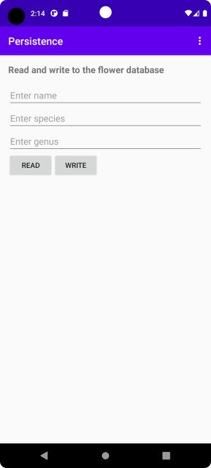
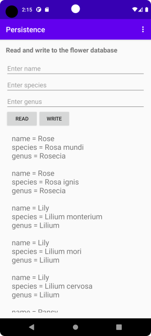
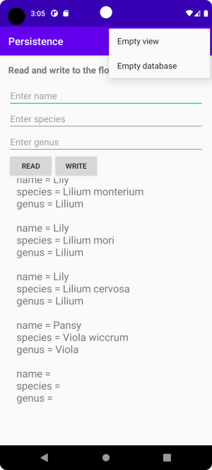
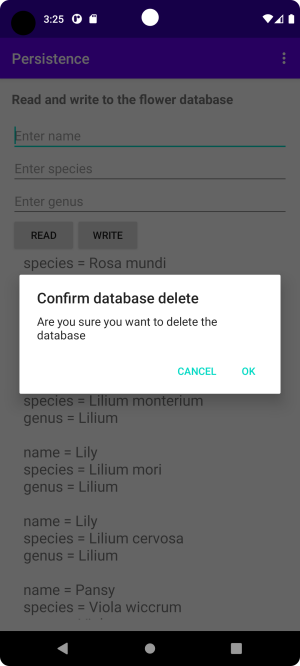

# Rapport

**SQLite**

Jag har löst denna uppgift genom att skriva ett program som tar inmatning om blommor och lagrar detta i en sqlite-databas. Databasen har en tabell med namnet flowers. Inmatningen består av tre fält där man matar in namn, art och släkte. Man sparar datan genom att trycka på knappen WRITE. För att visa lagrad data så trycker man på knappen READ. Blommorna representeras i programmet av klassen Flower.

----


Efter att man tryckt på READ-knappen så kommer data hämtas ur databasen och visas i en TextView precis under. Har man tillräckligt mycket data för att täcka upp mer än det utrymme som finns på skärmen så kommer man kunna scrolla fram och tillbaka då Textvyn omges av en ScrollView. 



Den data som hämtats ur databasen lagras i variabeln flowerList vilket är en lista med objekt av typen Flower. Innan dessa kan visas upp i textvyn måste de omvandlas till en sträng vilket sker i klickhanteraren för READ-knappen. Denna börjar med att tömma listan, varefter all data i tabellen flowers hämtas och lagras i denna lista. Variabeln flowerQuery är ett objekt av typen FlowerTableQuery vilket är klassen som sköter all databashantering. När flowerQuery skapas så skickas flowerList med via konstruktorn och binds till objektet(detta var välmotiverat i programmets ursprungliga design där textvyn var en recyclerview, icke lika vämotiverat i nuvarande design men jag har valt att inte ändra på det), vilket medför att listan fylls på med Flower-objekt i metoden flowerQuery.selectFlowers(). 

Därefter slås alla Flower objekt ihop till en lång sträng i for-loopen. Denna sträng presenteras sedan i textvyn precis under knapparna, som vi har en referns till via variabeln displayDataView.   

```
/* Fetch contents of database and display in a view */

public void onClickRead(View v) {
    //Log.d("onClickRead_top:", flowerList.toString());
    
    /* we need to append to the string so we use 
     *  the mutable string type StringBuilder
     */
    StringBuilder data = new StringBuilder(); 
    flowerList.clear();
    try {
            flowerQuery.selectFlowers(); //query database
        }catch(SQLiteAccessPermException e) {
            editFlowerName.setText("You don't have permission to read the database");
        }catch(SQLiteCantOpenDatabaseException e) {
            editFlowerName.setText("Can't open the database");
        }finally {
            editFlowerSpecies.setText("");
            editFlowerGenus.setText("");
            return;
    }
    
    /* take the data received and build the string 
     * to be displayed in the TextView
     */ 
    for(int i=0; i < flowerList.size(); i++) {
        data.append(flowerList.get(i).toString());
    }
    displayDataView.setText(data);
    //flowerAdapter.notifyDataSetChanged();
    //Log.d("onClickRead:", flowerList.toString());
}
```

När man trycker på WRITE-knappen så läses redigeringsfälten i dess klickhanterare, därefter så anropas flowerQuery.insertFlower() för att skriva denna data till databasen. Precis som selectFlowers ovan kan den slänga ett undantag varför den också omges av ett try-block. Undantaget som hanteras slängs om man försöker mata in en databaspost som är identisk med en redan existerande eftersom tabellen är definieraded med en nyckel av typen UNIQUE(name, species, genus). Vi fångar då detta och visar ett lämpligt felmeddelande i första första redigeringsfältet.   

```
/* write the contents of the EditText fields to the database */
public void onClickWrite(View v) {
    /* get data */
    String name = editFlowerName.getText().toString();
    String species = editFlowerSpecies.getText().toString();
    String genus = editFlowerGenus.getText().toString();

    

    /* insert data in database, if an entry is identical to an existing entry
     *  a unique constraint will be violated and insertFlowerData() will throw 
     *  an SQLiteConstraintException, we catch that and display a suitable message
     */
    try {
        flowerQuery.insertFlowerData(name, species, genus);
    }catch (SQLiteConstraintException e){
        editFlowerName.setText("Entries have to be unique");
        editFlowerSpecies.setText("");
        editFlowerGenus.setText("");
        return;
    }

    /*clear edit fields */
    editFlowerName.setText("");
    editFlowerSpecies.setText("");
    editFlowerGenus.setText("");
    //flowerAdapter.notifyDataSetChanged(); //part of recyclerview design
}
```

Man kan även tömma den existerande vyn genom att klicka på Empty view i menyn.

   

Gör man det så kommer onOptionsItemSelected(MenuItem item) att exekveras, vi kontrollerar vilket id item har och om det är R.id.action_empty_view så tömmer vi flowerList och sätter innehållet i displayDataView till en tom sträng så att ingenting syns i denna.   

```
/* clear the view showing the contents of the database */
   if (id == R.id.action_empty_view) {
      Log.d("onOptionItemSelected","clear view");
      /* clear the view */
      flowerList.clear(); // empty flowerList
      displayDataView.setText(""); // set the TextView to display empty string
      //flowerAdapter.notifyDataSetChanged(); //part of recyclerview design
      return true;
}
```

Skulle man vilja tömma databasen så går detta också att göra genom att klicka på "Empty database" i menyn. Detta är dock en stor sak att göra och ingenting som bör ske av misstag, därför öppnas en dialog om man klickar på detta menyval för att användaren skall få en chans att bekräfta att han verkligen avsåg att tömma databasen. 



Detta sköts av klassen ConfirmDialog som förlänger(extends) klassen DialogFragment. I denna så registreras två klickhanterare, en för CANCEL-knappen och en för OK-knappen. När menyvalet ""Empty database" görs så anropas showDialog() ifrån menyhanteraren. I denna metod så skapas ett objekt av typen ConfirmDialog och objekten flowerQuery, flowerList och displayDataView tillgängliggörs för detta objekt med hjälp av set-metoder. Detta för att relevant arbete skulle kunna ske i klickhanteraren för OK-knappen (dvs tömma databasen och vyn) när denna klickas. Klickas CANCEL-knappen behöver ingenting göras så den lämnas tom. Det hade varit en bättre design att bara skicka tillbaka information ifrån dialogen till aktuell Activity om vilken knapp som tryckts, och därefter vidtagit relevant åtgärd, men jag vet ännu inte hur man gör det så därav nuvarande design. 

```
@NonNull
@Override
public Dialog onCreateDialog(@Nullable Bundle savedInstanceState) {
    AlertDialog.Builder builder = new AlertDialog.Builder(getActivity());
    builder.setTitle("Confirm database delete")
            .setMessage("Are you sure you want to delete the database")
            .setPositiveButton("OK", new DialogInterface.OnClickListener() {
                @Override
                public void onClick(DialogInterface dialog, int which) {
                    // Handle positive button click
                    flowerQuery.deleteAllFlowerRows();
                    flowerList.clear();
                    dataDisplayView.setText("");
                }
            })
            .setNegativeButton("Cancel", new DialogInterface.OnClickListener() {
                @Override
                public void onClick(DialogInterface dialog, int which) {
                    // Handle negative button click
                }
            });
    return builder.create();
}
```


